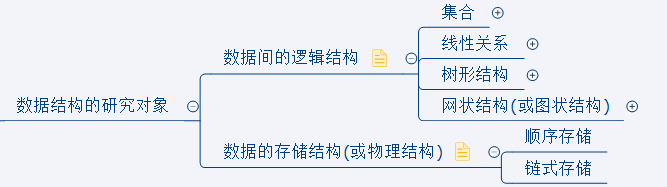
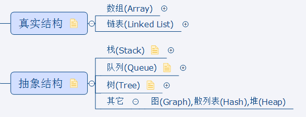
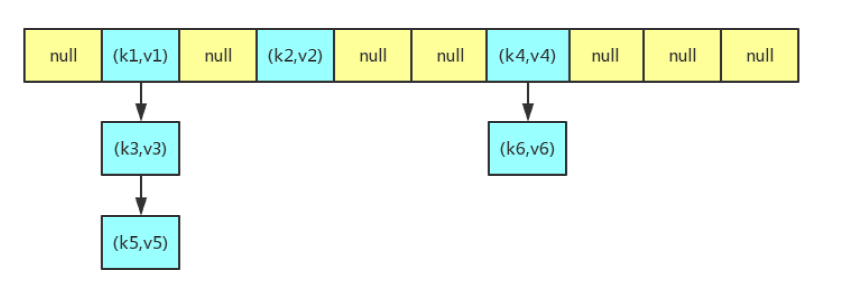
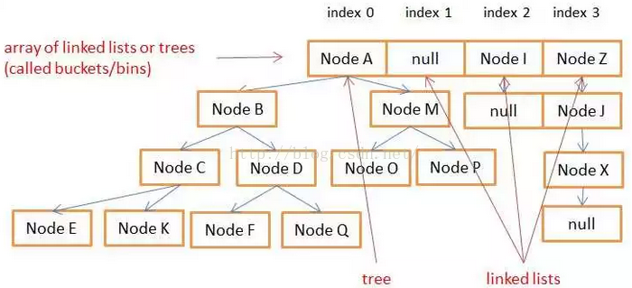
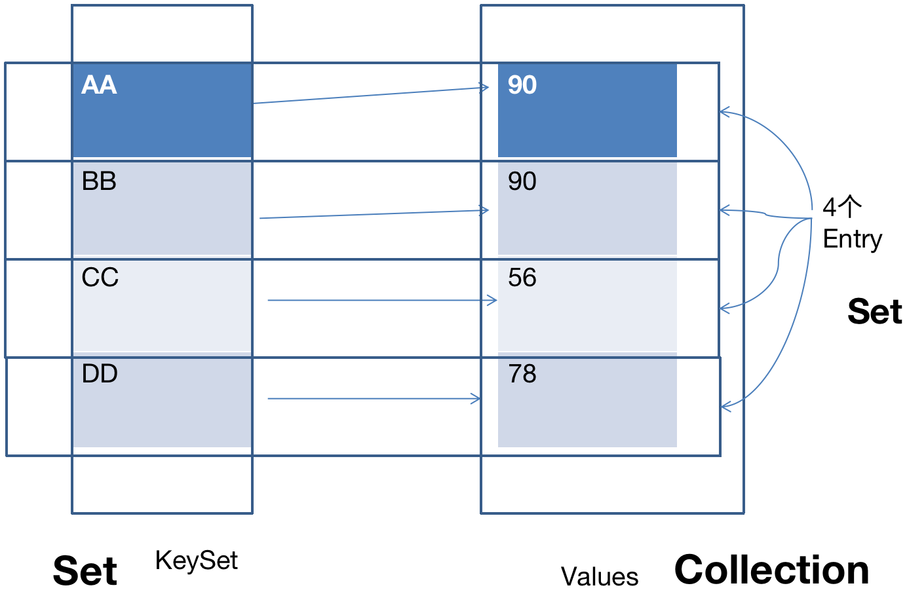
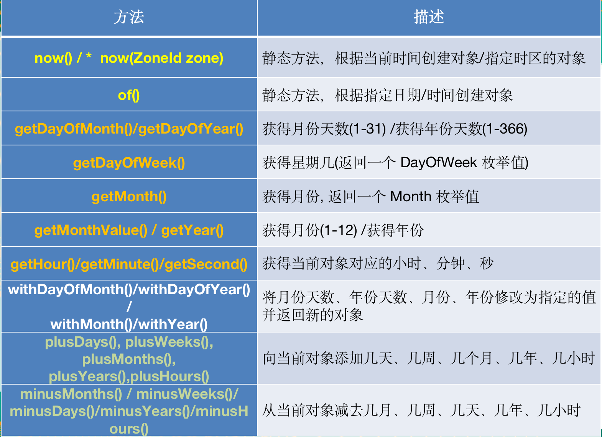
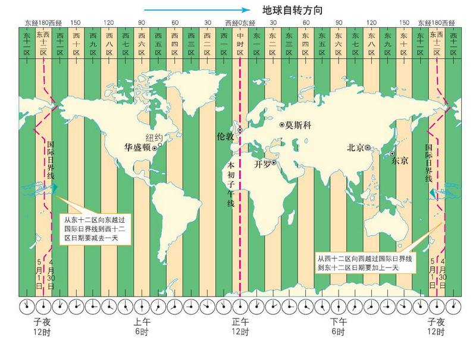
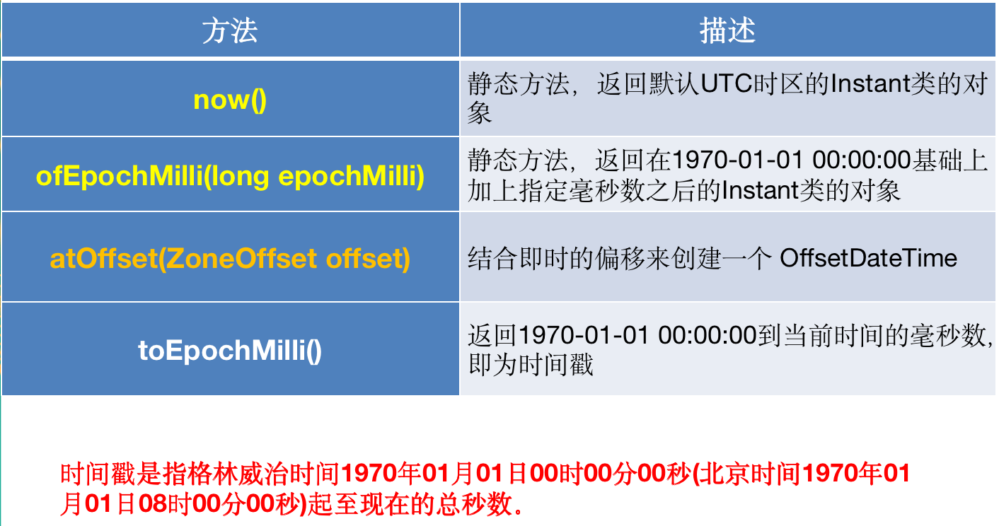
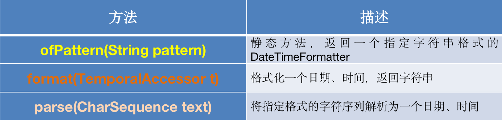
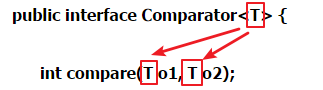

## 简介
Java 8 (又称为 jdk 1.8) 是 Java 语言开发的一个主要版本，也是LTS（ long-term support）官方长期支持版本。Java 8 是oracle公司于2014年3月发布，可以看成是自Java 5 以来最具革命性的版本。Java 8为Java语言、编译器、类库、开发工具与JVM带来了大量新特性。 
 
    代码更少(增加了新的语法：Lambda 表达式)  
    强大的 Stream API  
    速度更快  
    最大化减少空指针异常：Optional  
    Nashorn引擎，允许在JVM上运行JS应用  
    便于并行  
- - -
## 清单
1、<a href="#mark-1">接口的新特性</a>  
2、<a href="#mark-2">注解的新特性</a>  
3、<a href="#mark-3">集合的底层源码实现</a>  
4、<a href="#mark-4">新日期时间的API</a>  
5、<a href="#mark-5">Optional类的使用</a>  
6、<a href="#mark-6">Lambda 表达式(Lambda Expressions)</a>  
7、<a href="#mark-7">函数式接口</a>  
8、<a href="#mark-8">Stream API</a> 
- - -
## 详细
### <div id="mark-1">接口的新特性</div>
Java 8中，你可以为接口添加静态方法和默认方法。从技术角度来说，这是完全合法的，只是它看起来违反了接口作为一个抽象定义的理念。

    1.静态方法
    2.默认方法

* 静态方法  
> 静态方法使用 ***static*** 关键字修饰。可以通过接口直接调用静态方法，并执行其方法体。我们经常在相互一起使用的类中使用静态方法。你可以在标准库中找到像Collection/Collections或者Path/Paths这样成对的接口和类。
```
public interface A {
    public static void method() {
	    System.out.println(“hello lambda!");
    }
}

```
* 默认方法
> 默认方法使用 ***default*** 关键字修饰。可以通过实现类对象来调用。我们在已有的接口中提供新方法的同时，还保持了与旧版本代码的兼容性。
比如：java 8 API中对Collection、List、Comparator等接口提供了丰富的默认方法。
```
public interface A {
    public default void method1() {
	    System.out.println("北京");
    }
    default String method2() {
        return "上海";
    }
}
```
> ***"类优先"*** 原则  
若一个接口中定义了一个默认方法，而另外一个父类或接口中又定义了一个同名的方法时:  
1.选择父类中的方法。如果一个父类提供了具体的实现，那么接口中具有相同名称和参数的默认方法会被忽略  
2.接口冲突。如果一个父接口提供一个默认方法，而另一个接口也提供了一个具有相同名称和参数列表的方法（不管方法是否是默认方法），那么实现类必须覆盖该方法来解决冲突  
```
interface MyFunc {
    default String getName() {
        return "Hello Java8!";
    }
}

interface Named {
    default String getName() {
        return "Hello Java!";
    }
}

class MyClass implements MyFunc, Named {
    public String getName() {
        return Named.super.getName();
    }
}
```
- - -
### <div id="mark-2">注解的新特性</div>
Java 8对注解处理提供了两点改进：可重复的注解及可用于类型的注解。此外，反射也得到了加强，在Java8中能够得到方法参数的名称。这会简化标注在方法参数上的注解。

    1.可重复注解 （Repeating annotations）
    2.类型注解

* 可重复注解
> 自从Java 5 引入注解以来，这个特性变得非常流行并且被广泛使用。然而，注解的一个使用限制是，在同一个位置，相同的注解不能声明两次。Java 8解除了这个规则并且引入了重复注解的概念，它允许相同的注解在同一个位置声明多次。重复注解本身在定义时需要使用@Repeatable注解修饰。实际上，这个并不算是语言的改变，而是一个编译器欺骗，底层技术保持不变。  
使用方式注意两点：1.在需要重复的注解上声明@Repeatable，设置其成员值为包含其的注解（如：XXX.class），2.设置需要重复的注解的Target和Retention等元注解与包含其的注解相同。也就是要想定义重复注解，必须给它定义的容器类，还要使用 @Repeatable 注解修饰一下
```
import java.lang.annotation.Repeatable;
import java.lang.annotation.Retention;
import java.lang.annotation.RetentionPolicy;
import java.lang.annotation.Target;
import java.lang.reflect.Method;

import static java.lang.annotation.ElementType.*;

/**
 * @author: panlingfeng
 * @createDate: 2021/12/9 11:01 上午
 */
public class Demo {
    public static void main(String[] args) throws NoSuchMethodException {
        Class<Demo> clazz = Demo.class;
        Method method = clazz.getMethod("show");
        // 获取方法上的注解
        RepetitionAnnotation[] ras = method.getAnnotationsByType(RepetitionAnnotation.class);
        for (RepetitionAnnotation repetitionAnnotation : ras) {
            System.out.println(repetitionAnnotation.value());
        }
    }

    @RepetitionAnnotation("Hello")
    @RepetitionAnnotation("World")
    public void show() {
    }
}


@Repeatable(RepetitionAnnotations.class)
@Target({TYPE, FIELD, METHOD, PARAMETER, CONSTRUCTOR, LOCAL_VARIABLE})
@Retention(RetentionPolicy.RUNTIME)
@interface RepetitionAnnotation {
    String value() default "ling";
}

/**
 * 容器类
 */
@Target({TYPE, FIELD, METHOD, PARAMETER, CONSTRUCTOR, LOCAL_VARIABLE})
@Retention(RetentionPolicy.RUNTIME)
@interface RepetitionAnnotations {
    RepetitionAnnotation[] value();
}
```

执行输出

    Hello
    World

* 类型注解
> Java 8 扩展了注解的使用场景。现在，它几乎可以对Java中任何元素进行注解：局部变量、泛型、超类、甚至是函数的异常声明。就是扩展了 @Target 枚举类型，添加了***TYPE_PARAMETER、TYPE_USE***

    ElementType.TYPE_PARAMETER 表示该注解能写在类型变量的声明语句中（如：泛型声明）
    ElementType.TYPE_USE 表示该注解能写在使用类型的任何语句中

```
import java.lang.annotation.ElementType;
import java.lang.annotation.Retention;
import java.lang.annotation.RetentionPolicy;
import java.lang.annotation.Target;
import java.util.ArrayList;
import java.util.Collection;

public class Annotations {
    @Retention(RetentionPolicy.RUNTIME)
    @Target({ElementType.TYPE_USE, ElementType.TYPE_PARAMETER})
    public @interface NonEmpty {
    }

    public static class Holder<@NonEmpty T> extends @NonEmpty Object {
        public void method() throws @NonEmpty Exception {
        }
    }

    @SuppressWarnings("unused")
    public static void main(String[] args) {
        final Holder<String> holder = new @NonEmpty Holder<String>();
        @NonEmpty Collection<@NonEmpty String> strings = new ArrayList<>();
    }
}
```
- - -
### <div id="mark-3">集合的底层源码实现</div>
    1、你不可不知的数据结构
    2、ArrayList、LinkedList、Vector区别？
    3、ArrayList和LinkedList的底层源码实现
    4、HashMap和Hashtable的区别?
    5、HashMap的底层实现原理
    6、HashMap的存储结构
    7、LinkedHashMap的底层源码实现
    8、HashSet / LinkedHashSet 等底层源码有变化吗? 
* 你不可不知的数据结构




* ArrayList、LinkedList、Vector区别？
> List子接口：存储序的、可重复的数据 --> "动态"数组  
>> ArrayList：作为List的主要实现类；线程不安全的，效率高；底层使用数组实现
(Collections中定义了synchronizedList(List list)将此ArrayList转化为线程安全的)  
>> LinkedList：对于频繁的插入、删除操作，我们建议使用此类，因为效率高；内存消耗较ArrayList大；底层使用双向链表实现  
>> Vector：List的古老实现类；线程安全的，效率低；底层使用数组实现 

* ArrayList和LinkedList的底层源码实现
> ArrayList 源码分析
>> JDK7：  
ArrayList list = new ArrayList();//初始化一个长度为10的Object[] elementData
sysout(list.size());//返回存储的元素的个数:0
list.add(123);
list.add(345);
...
当添加第11个元素时，需要扩容，默认扩容为原来的1.5倍。还需要将原有数组中的数据复制到新的数组中。
删除操作：如果删除某一个数组位置的元素，需要其后面的元素依次前移。
remove(Object obj) / remove(int index)

>> JDK8：  
ArrayList list = new ArrayList();//初始化一个长度为0的Object[] elementData
sysout(list.size());//返回存储的元素的个数:0
list.add(123);//此时才创建一个长度为10的Object[] elementData
list.add(345);
...
当添加第11个元素时，需要扩容，默认扩容为原来的1.5倍。还需要将原有数组中的数据复制到新的数组中。

>> 总结（开发时的启示）：  
1、建议使用：ArrayList list = new ArrayList(int length)；  
2、JDK8延迟了底层数组的创建：内存的使用率；对象的创建更快；

> LinkedList 源码分析
>> LinkedList：底层使用双向链表存储添加的元素
```
void linkLast(E e) {
    final Node<E> l = last;
    final Node<E> newNode = new Node<>(l, e, null);
    last = newNode;
    if (l == null)
        first = newNode;
    else
        l.next = newNode;
    size++;
    modCount++;
}
内部类体现：
private static class Node<E> {
        E item;
        Node<E> next;
        Node<E> prev;
}
```

* HashMap和Hashtable的区别?
> HashMap：  
Map的主要实现类；线程不安全的，效率高；可以存储null的key和value
（存储结构：JDK7.0 数组+链表；JDK8.0 数组+链表+红黑树）

> Hashtable：  
Map的古老实现类；线程安全的，效率低；不可以存储null的key和value

* HashMap的底层实现原理
> JDK7：  
HashMap map = new HashMap();  
1、底层创建了长度为16的Entry数组，向HashMap中添加entry1(key，value)，需要首先计算entry1中key的哈希值(根据key所在类的hashCode()计算得到)，此哈希值经过处理以后，得到在底层Entry[]数组中要存储的位置i.如果位置i上没有元素，则entry1直接添加成功。如果位置i上已经存在entry2(或还有链表存在的entry3，entry4),则需要通过循环的方法，依次比较entry1中key和其他的entry是否equals.如果返回值为true.则使用entry1的value去替换equals为true的entry的value.如果遍历一遍以后，发现所有的equals返回都为false,则entry1仍可添加成功。entry1指向原有的entry元素。  
2、默认情况下，如果添加元素的长度 >= DEFAULT_INITIAL_CAPACITY * DEFAULT_LOAD_FACTOR (临界值threshold默认值为12)且新要添加的数组位置不为null的情况下，就进行扩容。默认扩容为原有长度的2倍。将原有的数据复制到新的数组中。  
> JDK8：  
HashMap map = new HashMap();  
1、默认情况下，先不创建长度为16的数组，当首次调用map.put()时，再创建长度为16的数组。  
2、当数组指定索引位置的链表长度>8时，且map中的数组的长度>64时，此索引位置上的所有entry使用红黑树进行存储。而JDK7中没有红黑树结构。  
3、新添加的元素如果与现有的元素以链表方式存储的时候：“七上八下”，JDK7下：新添加的当链表头，JDK8下：新添加的当链表尾。

* HashMap的存储结构
> JDK7及以前版本：HashMap是数组+链表结构(即为链地址法)。


> JDK8版本发布以后：HashMap是数组+链表+红黑树实现。


> 负载因子值的大小，对HashMap有什么影响？
>> 负载因子的大小决定了HashMap的数据密度，负载因子越大密度越大，发生碰撞的几率越高，数组中的链表越容易长，
 造成查询或插入时的比较次数增多，性能会下降。负载因子越小，就越容易触发扩容，数据密度也越小，意味着发生碰撞的几率越小，数组中的链表也就越短，查询和插入时比较的次数也越小，性能会更高。但是会浪费一定的内容空间。而且经常扩容也会影响性能，建议初始化预设大一点的空间。
 
* LinkedHashMap的底层源码实现
> LinkedHashMap继承于HashMap，在HashMap底层结构的基础上额外添加了一对链表：
```
static class Entry<K,V> extends HashMap.Node<K,V> {
        Entry<K,V> before, after;
}
```
* HashSet / LinkedHashSet 等底层源码有变化吗?



```
// HashSet
HashSet set = new HashSet();
Person p1 = new Person(1001,"AA");
Person p2 = new Person(1002,"BB");
set.add(p1);
set.add(p2);
p1.name = "CC";
set.remove(p1);
System.out.println(set);
set.add(new Person(1001,"CC"));
System.out.println(set);
set.add(new Person(1001,"AA"));
System.out.println(set);
// 其中，其中Person类中重写了hashCode()和equal()方法

```
- - -
### <div id="mark-4">新日期时间的API</div>
    1、旧版日期操作的缺陷
    2、Java8新版的日期操作
    3、新版日期包概况
    4、LocalDate、LocalTime、LocalDateTime 的API说明
    5、Instant 时间点
    6、格式化与解析日期或时间

* 旧版日期操作的缺陷

> 对日期和时间的操作一直是Java程序员最痛苦的地方之一

    如果我们可以跟别人说：“我们在1502643933071见面，别晚了！”那么就再简单不过了。但是我们希望时间与昼夜和四季有关，于是事情就变复杂了。JDK 1.0中包含了一个java.util.Date类，但是它的大多数方法已经在JDK 1.1引入Calendar类之后被弃用了。而Calendar并不比Date好多少。它们面临的问题是：
    可变性：像日期和时间这样的类应该是不可变的。
    偏移性：Date中的年份是从1900开始的，而月份都从0开始。
    格式化：格式化只对Date有用，Calendar则不行。
    此外，它们也不是线程安全的；不能处理闰秒等。

* Java8新版的日期操作

> Java 8中引入的java.time API 已经纠正了过去的缺陷，将来很长一段时间内它都会为我们服务。

> Java 8 吸收了 Joda-Time 的精华，以一个新的开始为 Java 创建优秀的 API。新的java.time中包含了所有关于**本地日期**（LocalDate）、**本地时间**（LocalTime）、**本地日期时间**（LocalDateTime）、**时区**（ZonedDateTime）和**持续时间**（Duration）的类。历史悠久的**Date**类新增了**toInstant()**方法，用于把**Date**转换成新的表示形式。这些新增的本地化时间日期API大大简化了日期时间和本地化的管理。

* 新版日期包概况

    java.time – 包含值对象的基础包  
    java.time.chrono – 提供对不同的日历系统的访问  
    java.time.format – 格式化和解析时间和日期  
    java.time.temporal – 包括底层框架和扩展特性  
    java.time.zone – 包含时区支持的类  

说明：大多数开发者只会用到基础包和**format**包，也可能会用到**temporal**包。因此，尽管有68个新的公开类型，大多数开发者，大概将只会用到其中的三分之一。

* LocalDate、LocalTime、LocalDateTime 的API说明

    LocalDate、LocalTime、LocalDateTime 类是其中较重要的几个类，它们的实例是不可变的对象，分别表示使用ISO-8601日历系统的日期、时间、日期和时间。它们提供了简单的本地日期或时间，并不包含当前的时间信息，也不包含与时区相关的信息。

 注：ISO-8601日历系统是国际标准化组织制定的现代公民的日期和时间的表示法，也就是公历。
 

* Instant 时间点
> 在处理时间和日期的时候，我们通常会想到年,月,日,时,分,秒。然而，这只是时间的一个模型，是面向人类的。第二种通用模型是面向机器的，或者说是连续的。在此模型中，时间线中的一个点表示为一个很大的数，这有利于计算机处理。在UNIX中，这个数从1970年开始，以秒为的单位；同样的，在Java中，也是从1970年开始，但以毫秒为单位。

> java.time包通过值类型Instant提供机器视图，不提供处理人类意义上的时间单位。Instant表示时间线上的一点，而不需要任何上下文信息，例如，时区。概念上讲，它只是简单的表示自1970年1月1日0时0分0秒（UTC）开始的秒数。因为java.time包是基于纳秒计算的，所以Instant的精度可以达到纳秒级。(1 ns = 10-9 s)   1秒 = 1000毫秒 =10^6微秒=10^9纳秒。



```
整个地球分为二十四时区，每个时区都有自己的本地时间。在国际无线电通信场合，为了统一起见，使用一个统一的时间，称为通用协调时(UTC, Universal Time Coordinated)。UTC与格林尼治平均时(GMT, Greenwich Mean Time)一样，都与英国伦敦的本地时相同。这里，UTC与GMT含义完全相同。
北京时区是东八区，领先UTC八个小时，在电子邮件信头的Date域记为+0800。如果在电子邮件的信头中有这么一行：Date: Fri, 08 Nov 2002 09:42:22 +0800 说明信件的发送地的地方时间是二○○二年十一月八号，星期五，早上九点四十二分（二十二秒），这个地方的本地时领先UTC八个小时(+0800， 就是东八区时间)。电子邮件信头的Date域使用二十四小时的时钟，而不使用AM和PM来标记上下午。以这个电子邮件的发送时间为例，如果要把这个时间转化为UTC，可以使用一下公式：UTC + 时区差 ＝ 本地时间，时区差东为正，西为负。
在此，把东八区时区差记为 +0800，
UTC + (＋0800) = 本地（北京）时间 (1) 
那么，UTC = 本地时间（北京时间）- 0800 (2)
0942 - 0800 = 0142
即UTC是当天凌晨一点四十二分二十二秒。

```


* 格式化与解析日期或时间

    java.time.format.DateTimeFormatter 类：该类提供了三种格式化方法：  
    预定义的标准格式，如：ISO_LOCAL_DATE_TIME；ISO_LOCAL_DATE  
    本地化相关的格式，如：ofLocalizedDate(FormatStyle.FULL)  
    自定义的格式，如：ofPattern("yyyy-MM-dd hh:mm:ss E")  



- - -

### <div id="mark-5">Optional类的使用</div>

    到目前为止，臭名昭著的空指针异常是导致Java应用程序失败的最常见原因。以前，为了解决空指针异常，Google公司著名的Guava项目引入了Optional类，Guava通过使用检查空值的方式来防止代码污染，它鼓励程序员写更干净的代码。受到Google Guava的启发，Optional类已经成为Java 8类库的一部分。

    Optional实际上是个容器：它可以保存类型T的值，或者仅仅保存null。Optional提供很多有用的方法，这样我们就不用显式进行空值检测。

    Optional类的Javadoc描述如下：这是一个可以为null的容器对象。如果值存在则isPresent()方法会返回true，调用get()方法会返回该对象。

> Optional<T> 类(java.util.Optional) 是一个容器类，代表一个值存在或不存在，原来用 null 表示一个值不存在，现在 Optional 可以更好的表达这个概念。并且可以避免空指针异常。

> 常用方法：  

    Optional.empty() : 创建一个空的 Optional 实例  
    Optional.of(T t) : 创建一个 Optional 实例  
    Optional.ofNullable(T t):若 t 不为 null,创建 Optional 实例,否则创建空实例  
    isPresent() : 判断是否包含值  
    T get(): 如果调用对象包含值，返回该值，否则抛异常  
    orElse(T t) :  如果调用对象包含值，返回该值，否则返回t  
    orElseGet(Supplier s) :如果调用对象包含值，返回该值，否则返回 s 获取的值  
    map(Function f): 如果有值对其处理，并返回处理后的Optional，否则返回 Optional.empty()  
    flatMap(Function mapper):与 map 类似，要求返回值必须是Optional  

- - -

### <div id="mark-6">Lambda 表达式(Lambda Expressions)</div>

    1、从匿名类到 Lambda 的转换举例 1
    2、从匿名类到 Lambda 的转换举例 2
    3、Lambda 表达式语法
    4、类型推断

    Lambda 是一个匿名函数，我们可以把 Lambda 表达式理解为是一段可以传递的代码（将代码像数据一样进行传递）。使用它可以写出更简洁、更灵活的代码。作为一种更紧凑的代码风格，使Java的语言表达能力得到了提升。

* 从匿名类到 Lambda 的转换举例 1
```
    //匿名内部类 表达方式
    Runnable r1 = new Runnable() {
        @Override
        public void run() {
            System.out.println("Hello World !");
        }
    };
    //Lambda 表达方式
    Runnable r2 = () -> System.out.println("Hello World !");

```
* 从匿名类到 Lambda 的转换举例 2
```
    //原来使用匿名内部类作为参数传递
    TreeSet<String> ts1 = new TreeSet<>(new Comparator<String>() {
        @Override
        public int compare(String o1, String o2) {
            return Integer.compare(o1.length(), o2.length());
        }
    });
    //Lambda表达式作为参数传递
    TreeSet<String> ts2 = new TreeSet<>((o1, o2) -> {
        return Integer.compare(o1.length(), o2.length());
    });

```
* Lambda 表达式语法  
    Lambda 表达式：在Java 8 语言中引入的一种新的语法元素和操作符。这个操作符为 “->” ， 该操作符被称为 Lambda 操作符或箭头操作符。它将 Lambda 分为两个部分：

    1、左侧：指定了 Lambda 表达式需要的参数列表  
    2、右侧：指定了 Lambda 体，是抽象方法的实现逻辑，也即 Lambda 表达式要执行的功能。

> 语法格式一：无参，无返回值
```
Runnable r1 = () -> {
    System.out.println("Hello Lambda!");
};
```
> 语法格式二：Lambda 需要一个参数，但是没有返回值。
```
Consumer<String> con = (String str) -> {
    System.out.println(str);
};
```
> 语法格式三：数据类型可以省略，因为可由编译器推断得出，称为“类型推断”
```
Consumer<String> con = (str) -> {
    System.out.println(str);
};
```
> 语法格式四：Lambda 若只需要一个参数时，参数的小括号可以省略
```
Consumer<String> con = str -> {
    System.out.println(str);
};
```
> 语法格式五：Lambda 需要两个或以上的参数，多条执行语句，并且可以有返回值
```
Comparator<Integer> com = (x, y) -> {
    System.out.println("实现函数式接口方法！");
    return Integer.compare(x, y);
};
```
> 语法格式六：当 Lambda 体只有一条语句时，return 与大括号若有，都可以省略
```
Comparator<Integer> com = (x, y) -> Integer.compare(x, y);
```
* 类型推断  
上述 Lambda 表达式中的参数类型都是由编译器推断得出的。Lambda 表达式中无需指定类型，程序依然可以编译，这是因为 javac 根据程序的上下文，在后台推断出了参数的类型。Lambda 表达式的类型依赖于上下文环境，是由编译器推断出来的。这就是所谓的“类型推断”。  


- - -

### <div id="mark-7">函数式接口</div>


