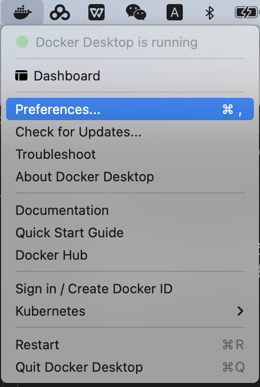
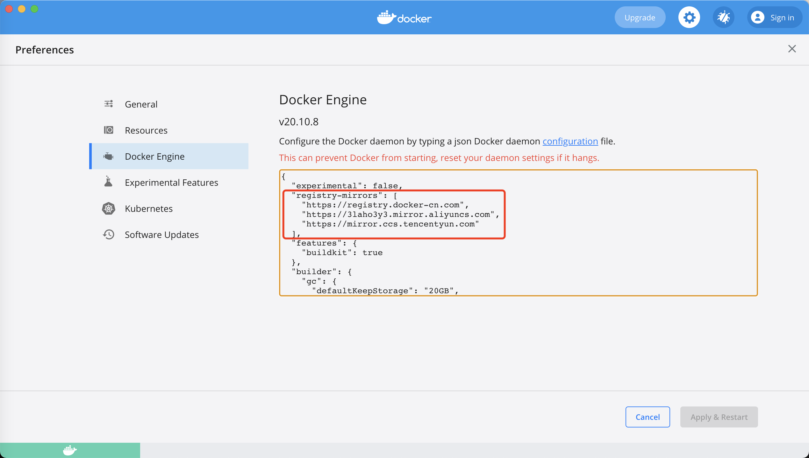

## mac 下

    国内访问 Docker 的官方仓库很慢，还经常断线，所以要把仓库网址改成国内的镜像站。这里推荐使用官方镜像 registry.docker-cn.com。

### 配置方式
#### 1- 打开Preferences窗口


#### 2- 复制下面代码
```
"registry-mirrors": ["https://registry.docker-cn.com", "https://3laho3y3.mirror.aliyuncs.com", "https://mirror.ccs.tencentyun.com"]
```


#### 3- 添加到图中位置
