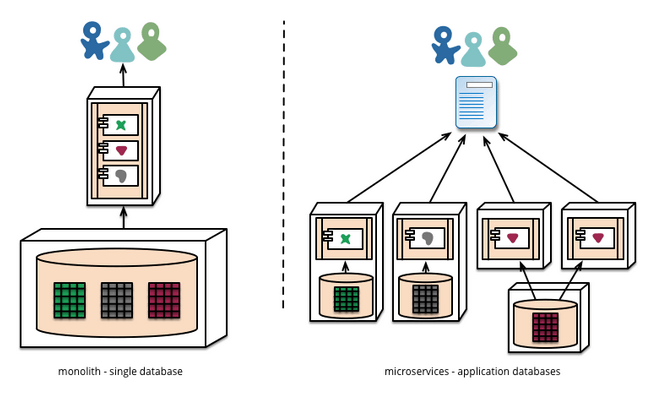
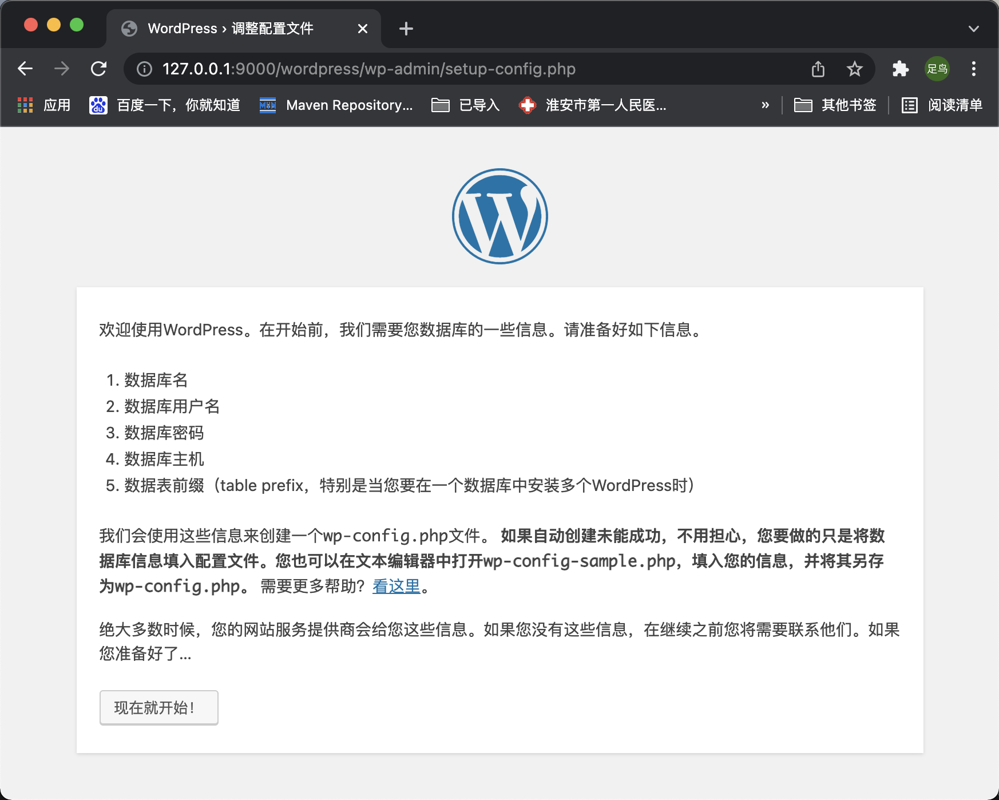

## 简介
Docker 是一个容器工具，提供虚拟环境。很多人认为，它改变了我们对软件的认识。

站在 Docker 的角度，软件就是容器的组合：业务逻辑容器、数据库容器、储存容器、队列容器......Docker 使得软件可以拆分成若干个标准化容器，然后像搭积木一样组合起来。

- - -
这正是微服务（microservices）的思想：软件把任务外包出去，让各种外部服务完成这些任务，软件本身只是底层服务的调度中心和组装层。

- - -
微服务很适合用 Docker 容器实现，每个容器承载一个服务。一台计算机同时运行多个容器，从而就能很轻松地模拟出复杂的微服务架构。

- - -
《快速入门.md》教程介绍了 Docker 的概念和基本用法，本文接着往下介绍，如何在一台计算机上实现多个服务，让它们互相配合，组合出一个应用程序。

我选择的示例软件是 WordPress。它是一个常用软件，全世界用户据说超过几千万。同时它又非常简单，只要两个容器就够了（业务容器 + 数据库容器），很适合教学。而且，这种"业务 + 数据库"的容器架构，具有通用性，许多应用程序都可以复用。

为了加深读者理解，本文采用三种方法，演示如何架设 WordPress 网站。

    方法 A：自建 WordPress 容器
    方法 B：采用官方的 WordPress 容器
    方法 C：采用 Docker Compose 工具

- - -

## 清单
1、<a href="#mark-1">准备工作：image 仓库的镜像网址</a>  
2、<a href="#mark-2">方法 A：自建 WordPress 容器</a>   
3、<a href="#mark-3">方法 B：Wordpress 官方镜像</a>  
4、<a href="#mark-4">方法 C：Docker Compose 工具</a>  

- - -

## 详情
### 准备工作：image 仓库的镜像网址
本教程需要从仓库下载 image 文件，但是国内访问 Docker 的官方仓库很慢，还经常断线，所以要把仓库网址改成国内的镜像站。这里推荐使用官方镜像 registry.docker-cn.com。配置方式参考同目录下的《修改image仓库的镜像网址.md》

### 方法 A：自建 WordPress 容器
> 首先，新建一个工作目录，并进入该目录。
* mkdir docker-demo && cd docker-demo
> 然后，执行下面的命令。
* docker container run -p 9000:80 --rm  --name wordpress --volume "$PWD/":/var/www/html php:5.6-apache

    -p 9000:80：将容器内80端口服务映射到外面本机9000上。  
    --rm：停止运行后，自动删除容器文件。  
    --name wordpress：容器的名字叫做wordpress。  
    --volume "$PWD/":/var/www/html：将当前目录（$PWD）映射到容器的/var/www/html（Apache 对外访问的默认目录）。因此，当前目录的任何修改，都会反映到容器里面，进而被外部访问到。

> 运行上面的命令以后，如果一切正常，打开浏览器，访问127.0.0.1:9000，你会看到下面的提示。


这是因为容器的/var/www/html目录（也就是本机的docker-demo目录）下面什么也没有，无法提供可以访问的内容。

> 在本机的docker-demo目录下面，添加一个最简单的 PHP 文件index.php，并输入下面内容。

    <?php 
    phpinfo();
    ?>

> 保存以后，浏览器刷新172.17.0.2，应该就会看到熟悉的phpinfo页面了。


> 拷贝 WordPress 安装包
* 既然本地的docker-demo目录可以映射到容器里面，那么把 WordPress 安装包拷贝到docker-demo目录下，不就可以通过容器访问到 WordPress 的安装界面了吗？
>> 首先，在docker-demo目录下，执行下面的命令，抓取并解压 WordPress 安装包。
```
wget https://cn.wordpress.org/wordpress-4.9.4-zh_CN.tar.gz
tar -xvf wordpress-4.9.4-zh_CN.tar.gz
```
>> 这时浏览器访问http://127.0.0.1:9000/wordpress/，就能看到 WordPress 的安装提示了


