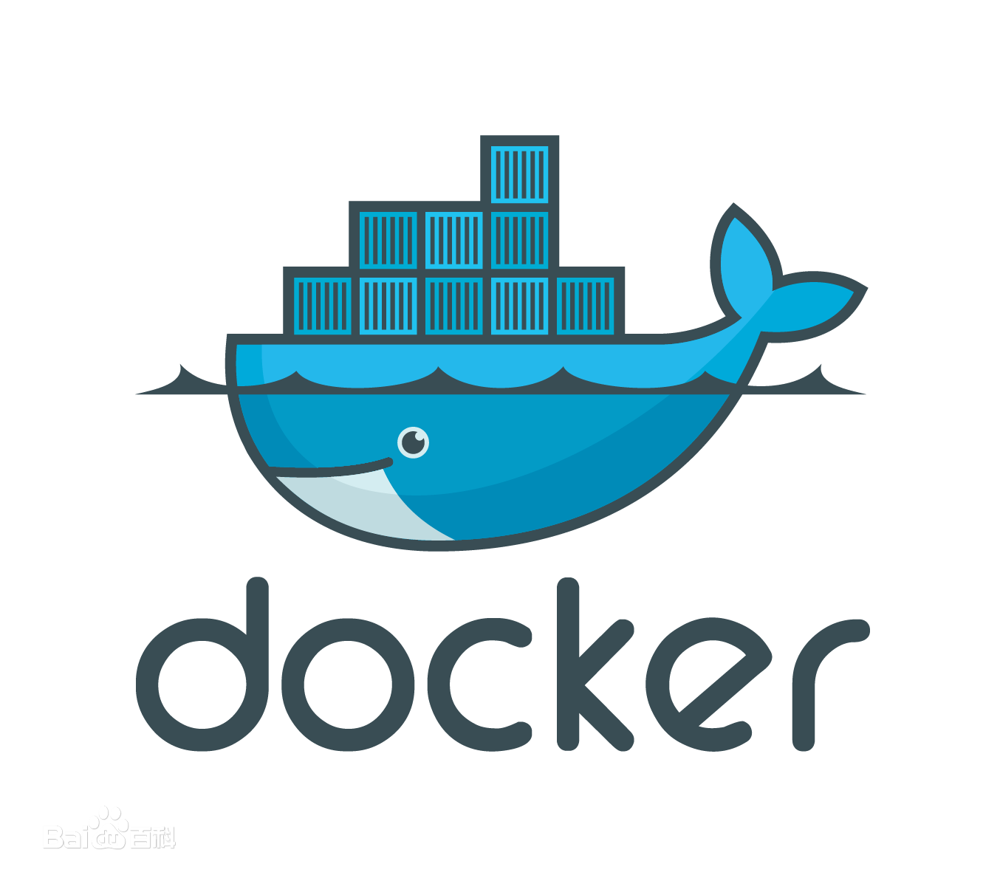

## 简介

    2013年发布至今， Docker 一直广受瞩目，被认为可能会改变软件行业。

    Docker 是一个开源的应用容器引擎，让开发者可以打包他们的应用以及依赖包到一个可移植的镜像中，然后发布到任何流行的 Linux或Windows操作系统的机器上，也可以实现虚拟化。容器是完全使用沙箱机制，相互之间不会有任何接口。

- - -

## 清单
1、产生背景
2、Docker 是什么?
3、Docker 的应用场景
4、Docker 的安装
5、image 文件
6、实例：hello world
7、容器文件
8、Dockerfile 文件
9、实例：制作自己的 Docker 容器
10、其他有用的命令

- - -

## 详情
### 产生背景
#### 1- 环境配置的难题
软件开发最大的麻烦事之一，就是环境配置。用户计算机的环境都不相同，你怎么知道自家的软件，能在那些机器跑起来？

用户必须保证两件事：操作系统的设置，各种库和组件的安装。只有它们都正确，软件才能运行。举例来说，安装一个 Python 应用，计算机必须有 Python 引擎，还必须有各种依赖，可能还要配置环境变量。

如果某些老旧的模块与当前环境不兼容，那就麻烦了。开发者常常会说："它在我的机器可以跑了"（It works on my machine），言下之意就是，其他机器很可能跑不了。

环境配置如此麻烦，换一台机器，就要重来一次，旷日费时。很多人想到，能不能从根本上解决问题，软件可以带环境安装？也就是说，安装的时候，把原始环境一模一样地复制过来。

#### 2- 虚拟机
虚拟机（virtual machine）就是带环境安装的一种解决方案。它可以在一种操作系统里面运行另一种操作系统，比如在 Windows 系统里面运行 Linux 系统。应用程序对此毫无感知，因为虚拟机看上去跟真实系统一模一样，而对于底层系统来说，虚拟机就是一个普通文件，不需要了就删掉，对其他部分毫无影响。

虽然用户可以通过虚拟机还原软件的原始环境。但是，这个方案有几个缺点：
* 资源占用多
> 虚拟机会独占一部分内存和硬盘空间。它运行的时候，其他程序就不能使用这些资源了。哪怕虚拟机里面的应用程序，真正使用的内存只有 1MB，虚拟机依然需要几百 MB 的内存才能运行。

* 冗余步骤多
> 虚拟机是完整的操作系统，一些系统级别的操作步骤，往往无法跳过，比如用户登录。

* 启动慢
> 启动操作系统需要多久，启动虚拟机就需要多久。可能要等几分钟，应用程序才能真正运行。

#### 3- Linux 容器
由于虚拟机存在这些缺点，Linux 发展出了另一种虚拟化技术：Linux 容器（Linux Containers，缩写为 LXC）。

Linux 容器不是模拟一个完整的操作系统，而是对进程进行隔离。或者说，在正常进程的外面套了一个保护层。对于容器里面的进程来说，它接触到的各种资源都是虚拟的，从而实现与底层系统的隔离。

由于容器是进程级别的，相比虚拟机有很多优势：
* 启动快
> 容器里面的应用，直接就是底层系统的一个进程，而不是虚拟机内部的进程。所以，启动容器相当于启动本机的一个进程，而不是启动一个操作系统，速度就快很多。

* 资源占用少
> 容器只占用需要的资源，不占用那些没有用到的资源；虚拟机由于是完整的操作系统，不可避免要占用所有资源。另外，多个容器可以共享资源，虚拟机都是独享资源。

* 体积小
> 容器只要包含用到的组件即可，而虚拟机是整个操作系统的打包，所以容器文件比虚拟机文件要小很多。总之，容器有点像轻量级的虚拟机，能够提供虚拟化的环境，但是成本开销小得多。（**Docker 就是 Linux 容器的一种解决方案**）

### Docker 是什么?

Docker 属于 Linux 容器的一种封装，提供简单易用的容器使用接口。它是目前**最流行**的 Linux 容器解决方案。

Docker 将应用程序与该程序的依赖，打包在一个文件里面。运行这个文件，就会生成一个虚拟容器。程序在这个虚拟容器里运行，就好像在真实的物理机上运行一样。有了 Docker，就不用担心环境问题。

总体来说，Docker 的接口相当简单，用户可以方便地创建和使用容器，把自己的应用放入容器。容器还可以进行版本管理、复制、分享、修改，就像管理普通的代码一样。

### Docker 的应用场景
Docker 的主要用途，目前有三大类：
* 1、提供一次性的环境。比如，本地测试他人的软件、持续集成的时候提供单元测试和构建的环境。
* 2、提供弹性的云服务。因为 Docker 容器可以随开随关，很适合动态扩容和缩容。
* 3、组建微服务架构。通过多个容器，一台机器可以跑多个服务，因此在本机就可以模拟出微服务架构。

### Docker 的安装
    Docker 是一个开源的商业产品，有两个版本：社区版（Community Edition，缩写为 CE）和企业版（Enterprise Edition，缩写为 EE）。企业版包含了一些收费服务，个人开发者一般用不到。下面的介绍都针对社区版。
* 1、去官方下载地址：<a href="https://docs.docker.com/desktop/mac/install/">下载对应版本</a>，安装方式像普通的软件一样，就不多介绍了。
* 2、安装完成后，运行下面的命令，验证是否安装成功
> docker version（或者 docker info）

* Docker 是服务器----客户端架构。命令行运行docker命令的时候，需要本机有 Docker 服务。如果这项服务没有启动，可以用下面的命令启动（官方文档）。

> service 命令的用法
>> sudo service docker start

> systemctl 命令的用法
>> sudo systemctl start docker

### image 文件
**Docker 把应用程序及其依赖，打包在 image 文件里面**。只有通过这个文件，才能生成 Docker 容器。image 文件可以看作是容器的模板。Docker 根据 image 文件生成容器的实例。同一个 image 文件，可以生成多个同时运行的容器实例。

image 是二进制文件。实际开发中，一个 image 文件往往通过继承另一个 image 文件，加上一些个性化设置而生成。举例来说，你可以在 Ubuntu 的 image 基础上，往里面加入 Apache 服务器，形成你的 image。
* 列出本机的所有 image 文件
> docker image ls
* 删除 image 文件
> docker image rm [imageName]

image 文件是通用的，一台机器的 image 文件拷贝到另一台机器，照样可以使用。一般来说，为了节省时间，我们应该尽量使用别人制作好的 image 文件，而不是自己制作。即使要定制，也应该基于别人的 image 文件进行加工，而不是从零开始制作。

为了方便共享，image 文件制作完成后，可以上传到网上的仓库。Docker 的官方仓库 <a href="https://hub.docker.com/">Docker Hub</a> 是最重要、最常用的 image 仓库。此外，出售自己制作的 image 文件也是可以的。

### 实例：hello world
下面，我们通过最简单的 image 文件"hello world"，感受一下 Docker。  
需要说明的是，国内连接 Docker 的官方仓库很慢，还会断线，需要将默认仓库改成国内的镜像网站，具体的修改方法参考同目录下的<a href="./修改image仓库的镜像网址.md">修改image仓库的镜像网址.md</a>